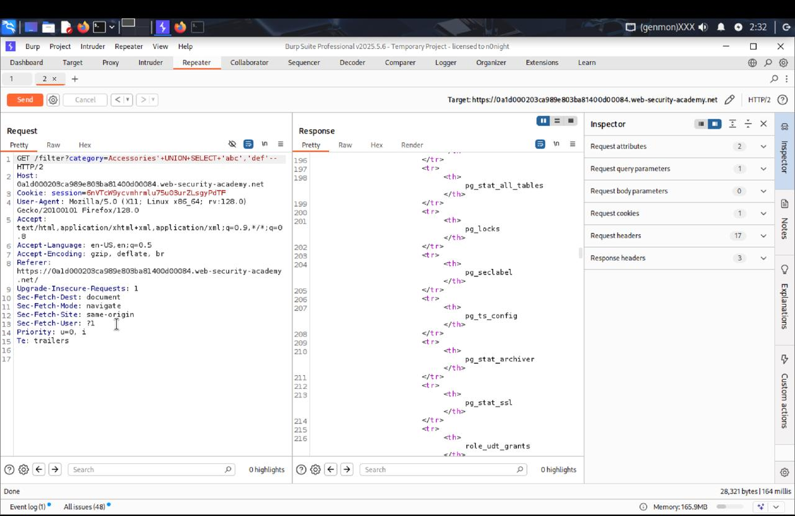
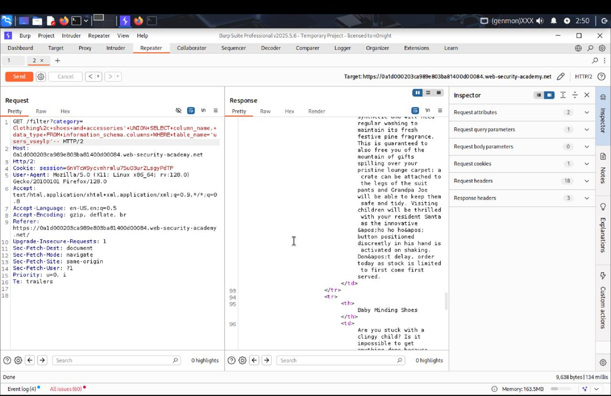
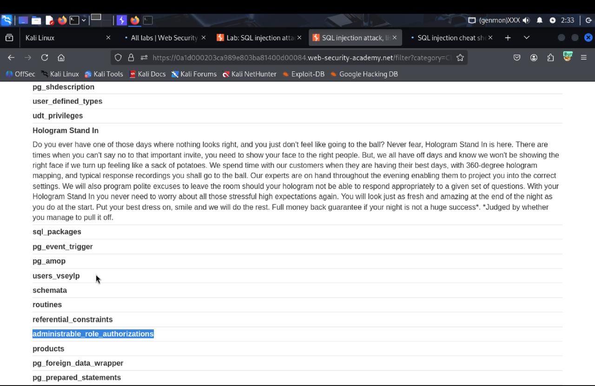
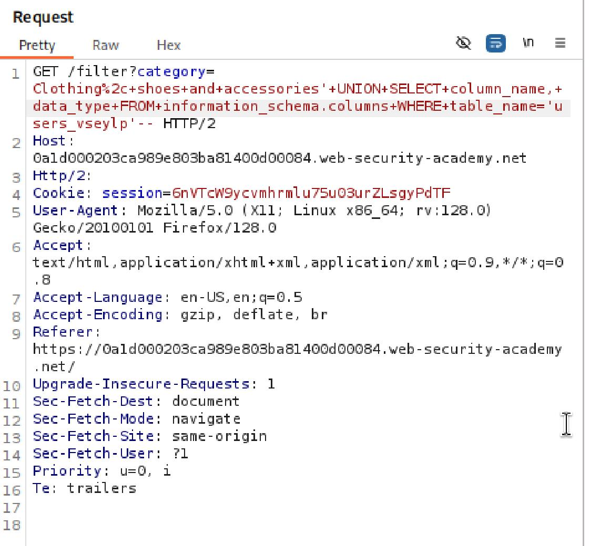
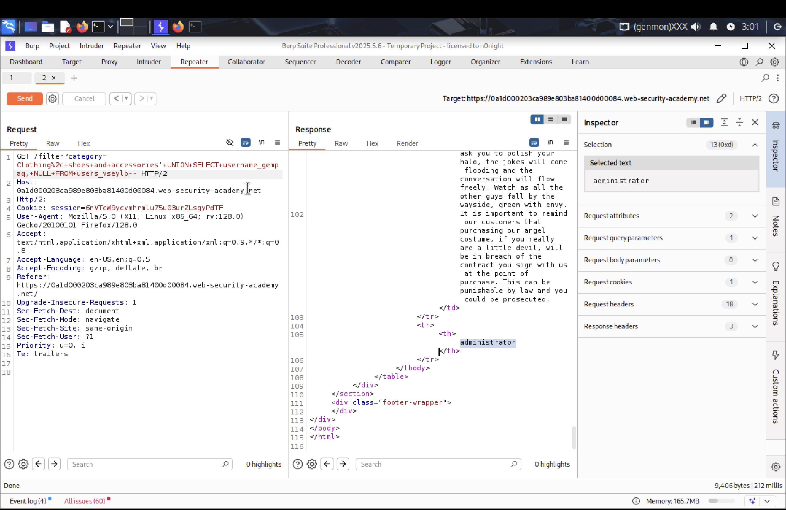
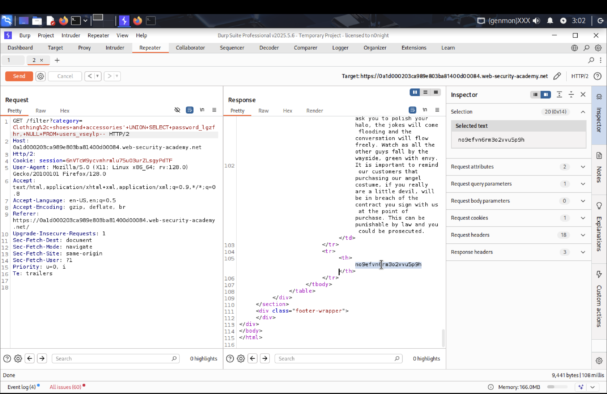
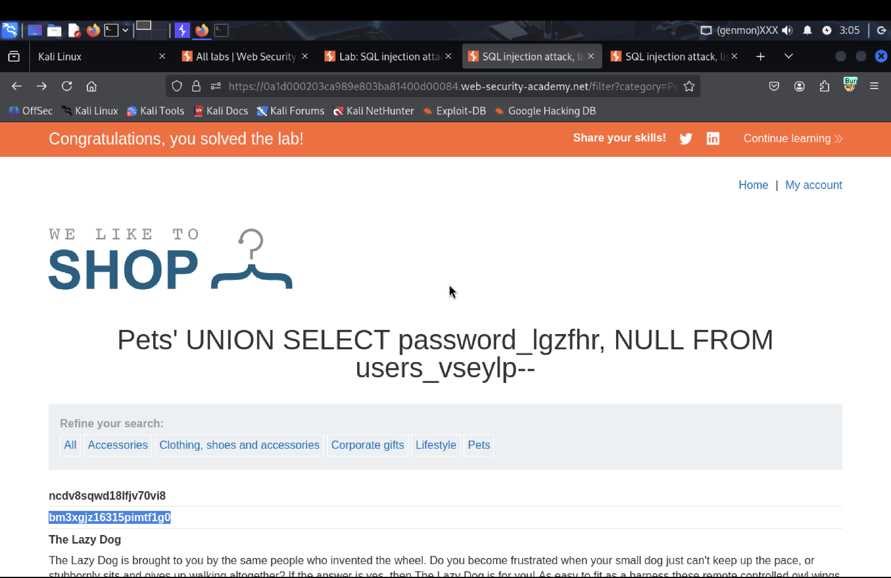
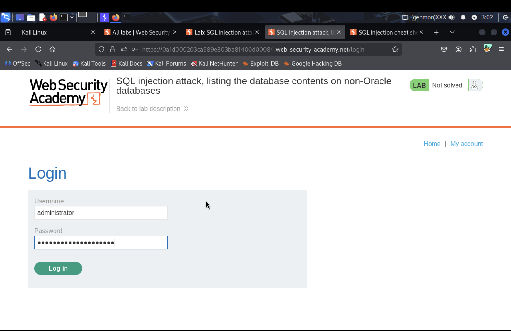
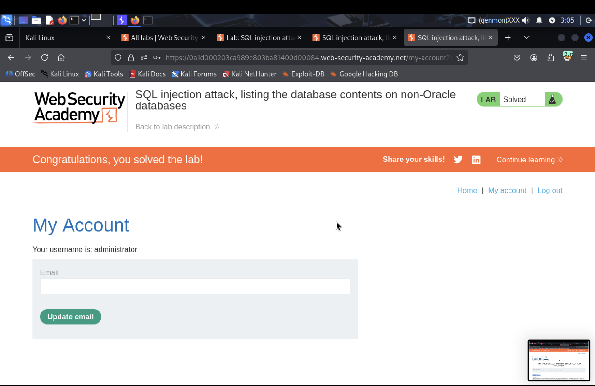

# SQLI

> **Target:** https://portswigger.net/web-security/sql-injection/examining-the-database/lab-listing-database-contents-non-oracle  
> **Endpoint / Path:** `/filter?category={text}` 
> **Date:** 2025-11-4  
> **Author:** _ksunnwy_

---

## 1. Summary

The lab contains a SQL injection vulnerability in the product category filter `/filter?category={text}`. The results from the query are returned in the application's response so you can use a UNION attack to retrieve data from other tables.

**Brief Impact:** Unauthorized access to and exfiltration of sensitive database information, including user credentials, personally identifiable information (PII), and other confidential data, directly from the application's response.

---

## 2. Impact

- **Level:** High  
- **Potential Impact:** Sensitive data exposure, account takeover, system compromise, reputational damage, legal and financial consequences

---

## 3. Instruments

- Burp Suite (Proxy, Repeater)
- browser (DevTools)

---

## 4. Proof of Concept

Here's a minimal PoC and steps to reproduce:
### 4.1. Payload (demo)

```html
'+UNION+SELECT+'abc', 'def'--
```

### 4.2. Example Steps (Burp)

1. Enable Burp Proxy and intercept the GET request to `/filter?category=Pets`.
2. In the request header, change the `filter` parameter to the payload.
3. In Burp Repeater, in the response to the GET request, get the username and password.

---

## 5. Steps to reproduce

1. Send a request to /filter?category=Pets.
2. Using Burp Repeater, verify that columns are indeed outputted when performing a SQL injection.
3. Using a SQLi payload, extract all tables from the database.
4. Identify the table containing user information.
5. Extract all columns from the user table.
6. Extract usernames and passwords separately.
7. Attempt to crack the administrator's password.
8. Go to the `/login`
9. Enter the retrieved credentials into the username and password fields.

> **Expected behavior:** Non-execution of malicious SQL code, the server should treat any user-supplied input as pure data, not as part of the SQL code itself.

---

## 6. Screenshots

- `./screenshots/01_verify_columns.jpg` — verify that columns are indeed outputted when performing a SQL injection
- `./screenshots/02_extract_all_tables.jpg` — Using a SQLi payload, extract all tables from the database
- `./screenshots/03_identify_users_table.jpg` — Identify the table containing user information
- `./screenshots/04_extract_all_columns.jpg` — Extract all columns from the user table
- `./screenshots/05_extract_usernames.png` — Extract usernames 
- `./screenshots/06_extract_passwords.png` — Extract passwords 
- `./screenshots/07_find_administrator's_password.png` — Attempt to crack the administrator's password
- `./screenshots/08_go_to_the_login.png` — Go to the `/login`
- `./screenshots/09_result.png` — Enter the retrieved credentials into the username and password fields

```markdown

















```

---

## 7. Mitigation / Fix

1. **Implement Prepared Statements** (Parameterized Queries). This is the most effective and fundamental defense against SQL injection. Instead of building SQL queries by concatenating strings that include user input, use prepared statements where user data is passed as separate parameters.
2. **Input Validation**. While prepared statements are the primary defense, robust input validation provides an additional layer of security.
3. **Least Privilege for Database Users**. The database user account that the application connects with should have the absolute minimum necessary permissions.
4. **Comprehensive Error Handling**. Avoid Verbose Error Messages: Configure the application and web server to never display detailed database error messages to the end-user. Detailed error messages can provide valuable information to attackers about the database type, version, and schema, aiding in further exploitation. Generic Error Pages: Instead, present a generic error message (e.g., "An unexpected error occurred. Please try again later.") and log the full error details internally for developers to review.
5. **Web Application Firewall (WAF)**. A WAF can provide an additional layer of defense by detecting and blocking common SQL injection patterns at the network edge before they even reach the application. While not a primary fix for the underlying code, it offers a valuable safety net.

---

## 8. References / Additional Materials

- OWASP SQL Injection Prevention Cheat Sheet
- W3Schools SQL Injection Tutorial
- Database-specific documentation on parameterized queries/prepared statements (e.g., PDO for PHP, JDBC for Java, psycopg2 for Python)

---

## 9. Notes / Ethical Disclaimers

- This PoC was created under test conditions. Do not use this code against systems without explicit permission from the owner (bug bounty program / signed engagement / pentest scope).


---